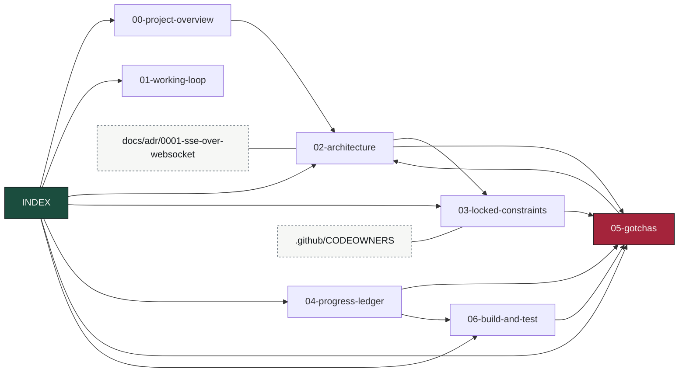

# OmniFlow Knowledge Base — Map of Content

> Obsidian-style vault. Entry point for restoring full context cheaply at the start of a session —
> read this first instead of re-deriving from code. Notes cross-link with `[[wikilinks]]`. Keep it
> current: when a fact changes, edit the note, don't append contradictions.

## Read order for a cold start
1. [[00-project-overview]] — what OmniFlow is and the mandate.
2. [[01-working-loop]] — how work gets done: branch, PR, required checks, self-merge.
3. [[02-architecture]] — the event spine: topics, changefeeds, services, data flow.
4. [[03-locked-constraints]] — the invariants, and which test guards each one.
5. [[04-progress-ledger]] — what is built and proven, and what is next.
6. [[05-gotchas]] — hard-won findings. **Highest value note. Read before editing anything.**
7. [[06-build-and-test]] — build/vet/E2E commands and the seeder.

## Vault graph

`05-gotchas` is the sink almost everything points at — that is the note to read, and the note to
update when something bites you.

## Canonical sources (authoritative, this KB summarizes them)
- `CLAUDE.md` — repo constraints auto-loaded into every Claude session.
- `README.md` / `SCOPE.md` — the reader-facing description and the explicit non-goals.
- `docs/adr/` — architecture decisions, with the reasoning that produced them.
- `.github/CODEOWNERS` — maps each load-bearing path to the test that guards it.

## One-line status (update every session)
**As of 2026-08-19:** `master` is branch-protected (9 required checks, `strict: true`, admins
included) and green. The spine is proven on real infrastructure in CI *and now locally* — Docker
Desktop is installed on the dev box and `bash scripts/e2e.sh` passes there (seed → changefeed → DAG →
HITL → SSE, HLC key intact), alongside **five** failure-survival proofs: durable resume,
exactly-once suppression, FIFO late-arrival restatement, DLQ poison-pill, and agent exactly-once
effect.

**The dependency queue is drained: 0 open Dependabot PRs** (was 12). `govulncheck` reports **0**
reachable CVEs after the toolchain was pinned to an exact 1.26.6 — it had been floating at `'1.25'`,
which resolves from the runner's tool cache and had silently served a stdlib with seven reachable
CVEs. Trivy alerts: **0** (was 14).

Landed since: real `/healthz` + `/readyz` on all four services (the old handler returned 200 before
the pgx pool opened a connection, so anything gating on it routed traffic to an instance that could
not serve); eight integration tests pinning the exactly-once CTE in `SaveCheckpoint`, which had none;
an explicit domain→proto enum mapping replacing a numeric cast that assumed a hand-written `iota`
block and a generated proto enum would stay aligned forever.

Next: no blocking work. Optional, and needing a human: enable **Dependabot alerts** (disabled
repo-wide — version updates run, but nothing is raised *because* an advisory landed), and add
`test agent exactly-once effect` to the required-checks list, where it is currently advisory.
See [[04-progress-ledger]].
