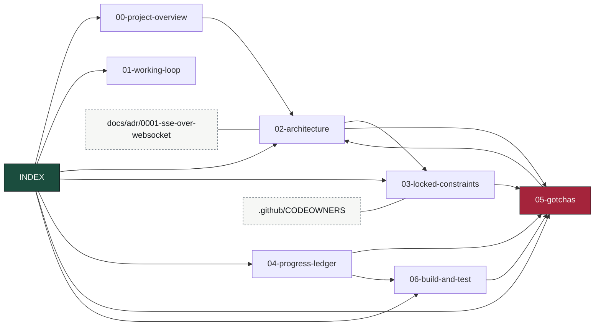

# OmniFlow Knowledge Base — Map of Content

> Obsidian-style vault. Entry point for restoring full context cheaply at the start of a session —
> read this first instead of re-deriving from code. Notes cross-link with `[[wikilinks]]`. Keep it
> current: when a fact changes, edit the note, don't append contradictions.

## Read order for a cold start
1. [[00-project-overview]] — what OmniFlow is and the mandate.
2. [[01-working-loop]] — how work gets done: branch, PR, required checks, self-merge.
3. [[02-architecture]] — the event spine: topics, changefeeds, services, data flow.
4. [[03-locked-constraints]] — the invariants, and which test guards each one.
5. [[04-progress-ledger]] — what is built and proven, and what is next.
6. [[05-gotchas]] — hard-won findings. **Highest value note. Read before editing anything.**
7. [[06-build-and-test]] — build/vet/E2E commands and the seeder.

## Vault graph

`05-gotchas` is the sink almost everything points at — that is the note to read, and the note to
update when something bites you.

## Canonical sources (authoritative, this KB summarizes them)
- `CLAUDE.md` — repo constraints auto-loaded into every Claude session.
- `README.md` / `SCOPE.md` — the reader-facing description and the explicit non-goals.
- `docs/adr/` — architecture decisions, with the reasoning that produced them.
- `.github/CODEOWNERS` — maps each load-bearing path to the test that guards it.

## One-line status (update every session)
**As of 2026-08-18:** `master` is branch-protected (9 required checks, `strict: true`, admins
included) and the full spine is proven on real infrastructure in CI: seed → changefeed →
orchestrator DAG → HITL suspend → approval → resume → changefeed → viz-gateway → SSE, with the HLC
key intact, plus four failure-survival proofs (durable resume, exactly-once suppression, FIFO
late-arrival restatement, DLQ poison-pill).

**The CI security gate was disarmed and is being repaired.** `govulncheck` floated its toolchain
(`go-version: '1.25'`), so `setup-go` kept serving the runner's cached 1.25.12 and the gate failed
on seven reachable stdlib CVEs fixed in 1.25.13. All ten sites (nine in `e2e.yml`, one in
`codeql.yml`) are now pinned to an exact `1.26.6`, which also aligns CI with the `golang:1.26`
builder stages it had silently diverged from. See [[05-gotchas]].

Consequence to remember: every green check dated **2026-08-07** predates those CVEs and is **not**
clearance. Re-run every open PR against the new baseline before merging anything.

Dependency queue: 12 open Dependabot PRs, and the root-Go ecosystem has hit
`open-pull-requests-limit` — its latest job *errored* ("cannot open any more pull requests"), so
new updates are being suppressed, not queued. Dependabot **alerts** are also disabled repo-wide
(version updates only). 44 open code-scanning alerts, of which nine HIGH `x/crypto/ssh` findings
should clear with the consolidated OTel PR #42 (`x/crypto` 0.51.0 → 0.54.0).

Next: outbox `SaveCheckpoint` has no Go test — the exactly-once claim rests on it and is currently
proven only by a full stack boot. See [[04-progress-ledger]].
