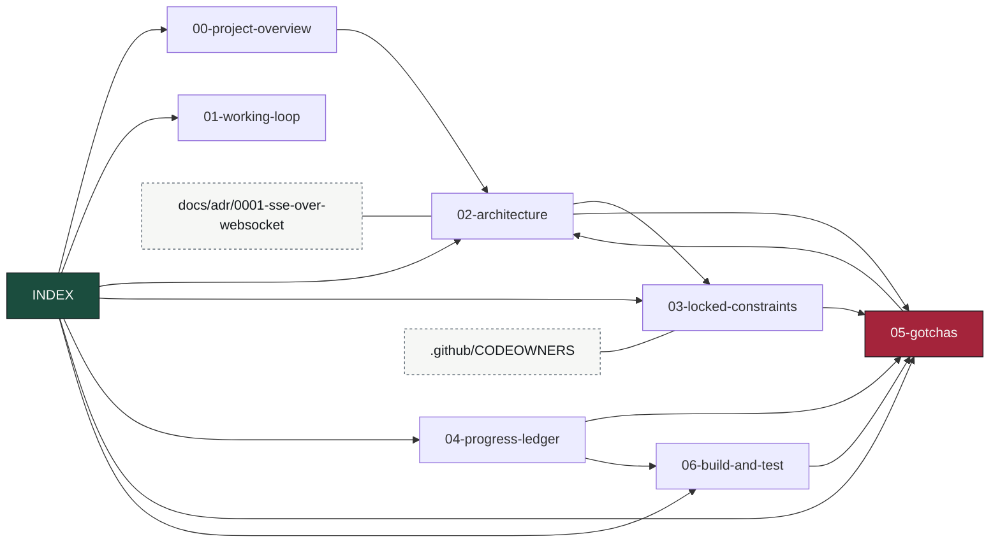

# OmniFlow Knowledge Base — Map of Content

> Obsidian-style vault. Entry point for restoring full context cheaply at the start of a session —
> read this first instead of re-deriving from code. Notes cross-link with `[[wikilinks]]`. Keep it
> current: when a fact changes, edit the note, don't append contradictions.

## Read order for a cold start
1. [[00-project-overview]] — what OmniFlow is and the mandate.
2. [[01-working-loop]] — how work gets done: branch, PR, required checks, self-merge.
3. [[02-architecture]] — the event spine: topics, changefeeds, services, data flow.
4. [[03-locked-constraints]] — the invariants, and which test guards each one.
5. [[04-progress-ledger]] — what is built and proven, and what is next.
6. [[05-gotchas]] — hard-won findings. **Highest value note. Read before editing anything.**
7. [[06-build-and-test]] — build/vet/E2E commands and the seeder.

## Vault graph

`05-gotchas` is the sink almost everything points at — that is the note to read, and the note to
update when something bites you.

## Canonical sources (authoritative, this KB summarizes them)
- `CLAUDE.md` — repo constraints auto-loaded into every Claude session.
- `README.md` / `SCOPE.md` — the reader-facing description and the explicit non-goals.
- `docs/adr/` — architecture decisions, with the reasoning that produced them.
- `.github/CODEOWNERS` — maps each load-bearing path to the test that guards it.

## One-line status (update every session)
**As of 2026-07-28:** all 9 required checks green on `master`, which is branch-protected
(`strict: true`, admins included) — every change lands via PR. The full spine is proven on real
infrastructure in CI: seed → changefeed → orchestrator DAG → HITL suspend → approval → resume →
changefeed → viz-gateway → SSE, with the HLC key intact, plus four failure-survival proofs
(durable resume, exactly-once suppression, FIFO late-arrival restatement, DLQ poison-pill).

Recently landed: one shared SQLSTATE taxonomy (`internal/platform/errclass`) replacing three
drifted per-service classifiers; real offset commits in inventory-intelligence (it had been
committing none at all); per-source-topic DLQ routing in the orchestrator.

Next: outbox `SaveCheckpoint` has no Go test — the exactly-once claim rests on it and is currently
proven only by a full stack boot. See [[04-progress-ledger]].
