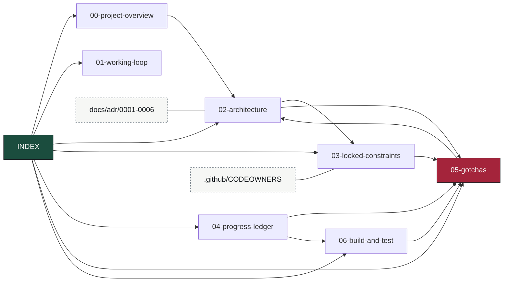

# OmniFlow Knowledge Base — Map of Content

> Obsidian-style vault. Entry point for restoring full context cheaply at the start of a session —
> read this first instead of re-deriving from code. Notes cross-link with `[[wikilinks]]`. Keep it
> current: when a fact changes, edit the note, don't append contradictions.

## Read order for a cold start
1. [[00-project-overview]] — what OmniFlow is and the mandate.
2. [[01-working-loop]] — how work gets done: branch, PR, required checks, self-merge.
3. [[02-architecture]] — the event spine: topics, changefeeds, services, data flow.
4. [[03-locked-constraints]] — the invariants, and which test guards each one.
5. [[04-progress-ledger]] — what is built and proven, and what is next.
6. [[05-gotchas]] — hard-won findings. **Highest value note. Read before editing anything.**
7. [[06-build-and-test]] — build/vet/E2E commands and the seeder.

## Vault graph

`05-gotchas` is the sink almost everything points at — that is the note to read, and the note to
update when something bites you.

## Canonical sources (authoritative, this KB summarizes them)
- `CLAUDE.md` — repo constraints auto-loaded into every Claude session.
- `README.md` / `SCOPE.md` — the reader-facing description and the explicit non-goals.
- `docs/adr/` — architecture decisions, with the reasoning that produced them: SSE over WebSocket,
  native changefeeds over Debezium, franz-go, the STRING sequence key, no separate BI tier, and the
  CockroachDB Regular release line. Each names the test that guards it.
- `docs/specs/` — deferred options that are NOT decisions (the WebSocket upgrade).
- `.github/CODEOWNERS` — maps each load-bearing path to the test that guards it.

## One-line status (update every session)
**As of 2026-09-22:** `master` is branch-protected (`strict: true`, admins included; the required
list lives in the protection settings, not restated here) and green. The spine is proven on real
infrastructure in CI and locally: seed → changefeed → DAG → HITL → SSE, plus six failure-survival
proofs (durable resume, exactly-once suppression, FIFO late-arrival restatement, DLQ poison-pill
both wire-level and semantic, agent exactly-once effect).

**An enterprise-readiness pass landed over four PRs**, each CI-verified:

- **Dependencies drained** — Next 16.3.5 (closing two critical unauthenticated-RCE advisories),
  sharp, gRPC 1.83.2, franz-go, protovalidate, testcontainers, actions. The Dependabot queue went
  21 open PRs → 0 and 8 open alerts → 0.
- **Security baseline** — ONE Go toolchain pin (the `toolchain` directive in both `go.mod`; ten YAML
  pins deleted, including one that had drifted to a floating `'1.25'`); every action SHA-pinned and
  every base image digest-pinned; new gates: `-race`, golangci-lint, shellcheck, and a real frontend
  job; `release.yml` publishes signed, attested, SBOM'd images to GHCR; Apache-2.0 LICENSE (the repo
  had none); `scripts/lib.sh` replaced ~45 lines copied into six proofs.
- **Backend** — the approval topic is validated and audited (`HumanApproved` carries the approver);
  `FailWorkflow` makes failure a state instead of a row stuck RUNNING forever; the HITL lease is
  swept, so an approval that never arrives no longer parks a purchase order indefinitely; Kafka
  TLS/SASL; telemetry (JSON logs with trace ids, one tracer provider, `/metrics`, an observability
  compose profile); jittered retries with ~32s of patience instead of ~6s.
- **Frontend + gateway** — 19 tests where there were none; `Last-Event-ID` resume (the gateway wrote
  `id:` and read it from nobody); a bounded, windowed ledger; CSP and the rest of the header set;
  a per-client rate limit on replay.

**Next:** no blocking work. The backlog in [[04-progress-ledger]] is the next milestone — lease-TTL
reclaim beyond the sweep, a DLQ re-drive tool, and a trace slice from the observability profile.

